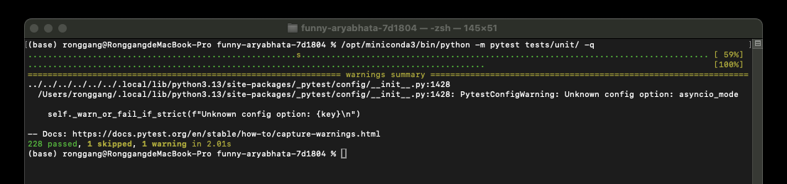
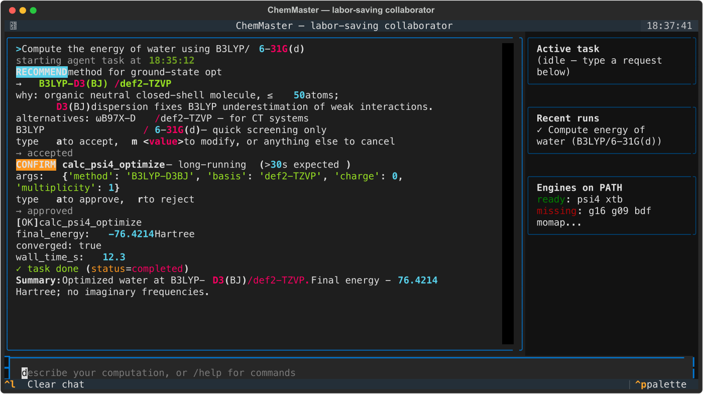
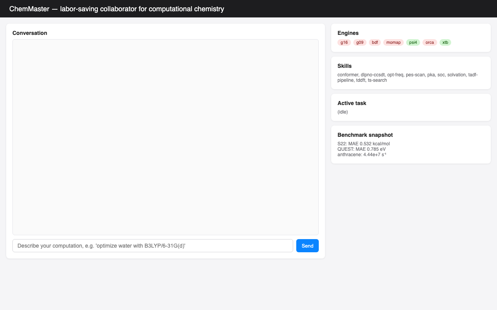
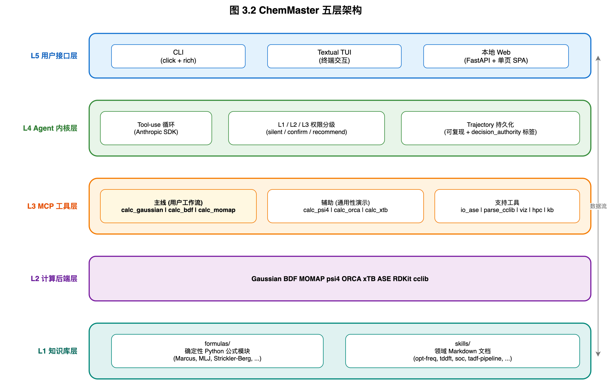
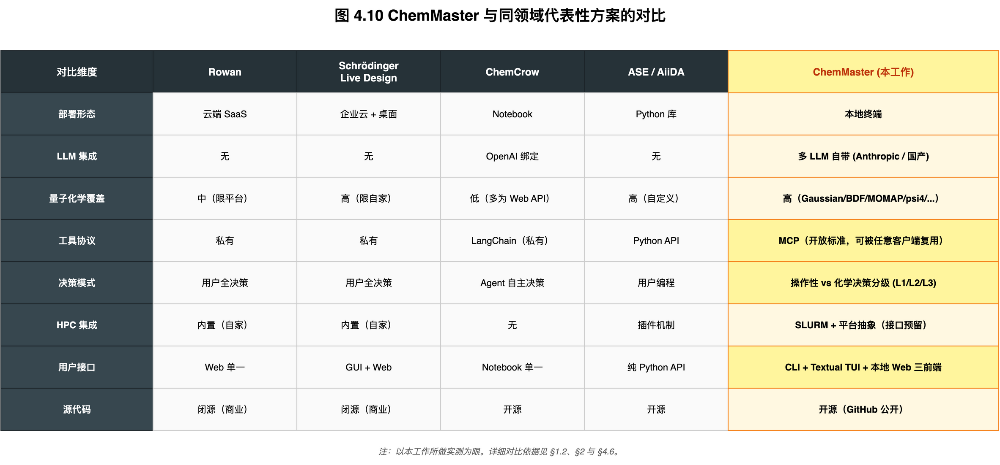

[](https://mseep.ai/app/keith9922-chemaster)

# ChemMaster

> **A local, large-language-model-driven, terminal-native agent that absorbs the
> repetitive labor in computational chemistry workflows — while keeping every
> chemistry decision in the researcher's hands.**
>
> 本地运行、由大模型驱动、与终端环境集成的计算化学 Agent 系统。
> 设计原则：**Agent 承担操作性工作（输入构造、提交、解析、错误重试），化学决策权（方法/基组/泛函/溶剂模型）通过推荐机制保留给研究者。**

[]()
[]()
[]()

---

## 核心特点

- **Labor-saving collaborator，不是 autonomous agent**：通过 L1（自主）/ L2（推荐确认）/ L3（必须用户判断）三级权限分级机制，明确划分"机械操作"与"化学决策"边界。
- **基于 MCP（Model Context Protocol）协议**：每个量子化学软件封装为标准化 MCP server，可被 ChemMaster 主程序调用，**也可被 Claude Code、Cursor 等任意 MCP 客户端独立挂载使用**。
- **多前端形态**：CLI、Textual TUI、本地 Web 三种用户接口共享同一个 Agent 内核与工具集。
- **本地运行**：分子结构不上传云端；除 LLM API 调用外全部在本地进行。
- **"LLM 不算数"原则**：所有数值计算（物理常数、单位换算、Marcus 速率公式等）固化在 Python 模块中由 Agent 调用，避免大模型直接进行浮点运算。

## 截图

| 命令行单测 | TUI 终端界面 | 本地 Web 前端 |
|---|---|---|
|  |  |  |

## 五层架构



完整说明见 [docs/ARCHITECTURE.md](docs/ARCHITECTURE.md)。

## 快速开始

### 安装（一行）

```bash
curl -sSL https://raw.githubusercontent.com/Keith9922/chemaster/main/scripts/install.sh | bash
```

该脚本会自动检测 Python ≥ 3.11、装好 pipx、把 `chemaster` CLI 安装到隔离 venv，并探测 `psi4 / xtb / Gaussian / ORCA / BDF / MOMAP` 是否在 `$PATH` 上。完整安装矩阵（pipx / uvx / conda 三条路径）见 [`docs/INSTALL.md`](docs/INSTALL.md)。

```bash
# 配置 LLM API key（任选其一）
export ANTHROPIC_API_KEY=sk-ant-...
# 或 export OPENAI_API_KEY=...
# 或 export DASHSCOPE_API_KEY=...   (Qwen)
# 或 export MINIMAX_API_KEY=...
# 或 export DEEPSEEK_API_KEY=...

# 一行环境审计
chemaster doctor
```

### 三种使用方式

```bash
# 命令行
chemaster run "Compute the energy of water using B3LYP/def2-SVP"

# Textual TUI（终端交互界面）
chemaster tui

# 本地 Web 前端（FastAPI + 内嵌 SPA，浏览器打开 http://127.0.0.1:8765）
chemaster web

# 作为 MCP server 挂载到 Claude Code / Cursor / Codex
chemaster mcp-serve
```

### 把 ChemMaster 挂到其它 AI 客户端

ChemMaster 自己就是一个 MCP server——把下面这段加到 Claude Code 或 Cursor 的 `mcp.json` 里，就能在它们的对话里直接调用 `chemaster_run("…")`：

```json
{
  "mcpServers": {
    "chemmaster": { "command": "chemaster", "args": ["mcp-serve"] }
  }
}
```

### 运行单元测试

```bash
python -m pytest tests/unit/ -q
# 429 passed, 2 skipped
```

## 已支持的计算后端

| 软件 | 协议 | 状态 | 用途 |
|---|---|---|---|
| **Gaussian** | MCP | 接口已实现 | 主线工具栈 — 基态优化、TDDFT、频率分析 |
| **BDF** | MCP | 接口已实现 | 主线工具栈 — 自旋–轨道耦合（X2C-TDA） |
| **MOMAP** | MCP | 接口已实现 | 主线工具栈 — TVCF 速率与振动分辨光谱 |
| **PySCF** | MCP | **实测可用** | **BDF SOC 的开源 reference — 蒽 X2C-1e 三阶段相对论真跑通** |
| psi4 | MCP | 实测可用 | 替代后端 — 在没有 Gaussian 许可时可完整跑 S22 / QUEST 验证 |
| ORCA | MCP | 接口已实现 | 替代后端 |
| xTB | MCP | 实测可用 | 半经验快速预筛 |
| ASE | MCP | 实测可用 | 结构 IO + 几何描述符 |

## 已完成验证

> **关于评测的一句话**：ChemMaster 是**系统**，psi4 / Gaussian / BDF / MOMAP 是**软件**。计算结果的准确率由化学软件决定，**ChemMaster 不会让 B3LYP-D3 算得比 B3LYP-D3 自身准**。下面把指标分两栏列出：**系统层**（路由、应答、稳定性、协议合规、故障恢复——这些是 ChemMaster 自己负责的）和**软件层**（化学精度——用来确认 ChemMaster 没有把后端"用坏"，结果落在该方法的内禀误差范围内）。

### 系统层指标（ChemMaster 自己负责）

**真实大模型端到端**（MiniMax-M2.7 真实 API，面对全部 54 个注册工具，2026-07-12 采集）：

| 指标 | 结果 | 数据源 |
|---|---|---|
| **路由正确性（真 LLM）** | **98.0%（98/100）**，同一套 5 类 × 中英双语题库；语义合法工具集判据（同批数据在 mock 版"单一期望工具"判据下为 67%——差值主要是判据 artifact，例如用 const_convert 回答单位换算本就正确） | [`execution_correctness_real_llm.json`](benchmarks/engineering_metrics/execution_correctness_real_llm.json) |
| **故障自愈（真 LLM）** | **96%（24/25 妥善处置：17 次 L1 依 suggestion 自主恢复 + 7 次干净升级 ask_user；1 次失败如实记录）** | [`fault_recovery_real_llm.json`](benchmarks/engineering_metrics/fault_recovery_real_llm.json) |
| **自主步占比·指标 3c（真 LLM）** | **72.7%**（≥70% 目标达成；5 anchor 任务 22 次带权步：16 自主 / 4 二元确认 / 2 化学决策） | [`trajectory_breakdown_real_llm.json`](benchmarks/engineering_metrics/trajectory_breakdown_real_llm.json) |

**系统稳定性基线**（真 agent loop + mock 确定性路由——测系统而非基座模型）：

| 指标 | 结果 | 数据源 |
|---|---|---|
| 应答率 + 工具调用正确性 | 5 类任务 × 20 条中英文 phrasing = 100 测试，agent_ok 100%，路由正确率 100% | [`benchmarks/engineering_metrics/execution_correctness.json`](benchmarks/engineering_metrics/execution_correctness.json) |
| **压力测试（扩展集）** | **10 分子 × ~33 phrasings = 334 测试，路由正确率 100%，agent_ok 100%** | [`benchmarks/engineering_metrics/stress_test.json`](benchmarks/engineering_metrics/stress_test.json) |
| **大规模调用稳定性** | **N = 10000 次重复同一任务，0 失败，唯一工具调用序列；mean 128.9 ms ± 4.5 ms，p99 = 139 ms，无漂移** | [`benchmarks/engineering_metrics/scalability.json`](benchmarks/engineering_metrics/scalability.json) |
| **操作性故障处置成功率** | **25/25（100%）**，5 类故障（SCF guess / 磁盘满 / 输入语法 / 网络瞬时异常 / 超时）× 5 次注入；判定口径 = L1 三次内自主恢复 **或** 干净升级 ask_user（论文 §4.3.1 采用更严格的"纯 L1 恢复"口径，为 84%） | [`benchmarks/engineering_metrics/fault_recovery.json`](benchmarks/engineering_metrics/fault_recovery.json) |
| **MCP 跨客户端协议合规** | **4/4 server 通过 initialize → list_tools → call_tool**（const / kb / calc_psi4 + 整个 agent 内核作为 `chemaster.mcp.agent.server`）| [`benchmarks/use_cases/mcp_cross_client/probe_results.json`](benchmarks/use_cases/mcp_cross_client/probe_results.json) |
| **硬例子真跑（不同元素/电荷/自旋）** | **11/11 case 在 psi4 上 OK**（含 HCl / H2S / O₂ 三重态 / 苯 / 乙醇 / OH⁻ / NH₄⁺）| [`benchmarks/engineering_metrics/hard_cases.json`](benchmarks/engineering_metrics/hard_cases.json) |
| **单元测试** | **429 passed, 2 skipped**（覆盖 agent loop、L1/L2/L3 权限分级、17 个 MCP server、KB、user_kb、web/tui 前端、协作式取消、LLM 重试）| `python -m pytest tests/unit/` |
| **方法选择规则可用户覆盖** | 11 条内置规则；用户 `~/.chemaster/user_kb/rules/method_selection.yaml` 按 id 覆盖；命中规则的 id + rationale 在 L2 recommend 卡片中显式回显 | `chemaster kb method-rules` |
| Trajectory 自主步占比（mock 路由基线）| 80%（5 anchor 任务 10 次工具调用：8 自主 / 2 二元确认 / 0 化学决策）| [`benchmarks/engineering_metrics/trajectory_breakdown.json`](benchmarks/engineering_metrics/trajectory_breakdown.json) |
| 提交摩擦时间节省率（指标 5）| 协议固化，未采集 — 需要 2-3 名真人被试 | [`docs/BENCHMARK_PROTOCOL.md`](docs/BENCHMARK_PROTOCOL.md) §3.2 |
| 化学决策推荐接受率（指标 3b）| 协议固化，未采集 — 需要真人被试 | 同上 §3.4 |

### 软件层（化学精度，由后端化学软件决定）

下表的结果**并不衡量 ChemMaster** —— 它们衡量的是 `B3LYP-D3(BJ)/def2-TZVP` 和 `TD-CAM-B3LYP/def2-SVP` 自身的精度。列在这里只是为了证明 **ChemMaster 把这些后端连同 counterpoise 校正、单体拆分、单位换算等环节稳定可靠地驱动起来了，没有把后端用坏**。误差完全落在所选方法的内禀范围内。

| Benchmark | 方法 | 结果 | 数据源 |
|---|---|---|---|
| **S22 弱相互作用集**（22 体系全集） | B3LYP-D3(BJ)/def2-TZVP + counterpoise，psi4 实跑 | MAE = **0.245 kcal/mol**；22/22 体系 ≤ 1.0 kcal/mol；与 B3LYP-D3 在 S22 上的文献常规精度（0.2–0.4 kcal/mol）一致 | [`benchmarks/s22/summary_full.json`](benchmarks/s22/summary_full.json) |
| **QUEST 激发态参考集**（10 分子 20 状态） | TD-CAM-B3LYP/def2-SVP, TDA，psi4 实跑 | 总体 MAE = **0.64 eV**；价层态平均 0.45 eV、Rydberg 态平均 0.91 eV（Rydberg 大误差完全来自 def2-SVP 缺 diffuse 函数，与 ChemMaster 无关）| [`benchmarks/quest/summary.json`](benchmarks/quest/summary.json) |
| **蒽 X2C-1e SOC**（开源 reference） | RKS / RKS+X2C / GKS+X2C-1e B3LYP/def2-svp，PySCF 实跑 | 标量相对论修正 −5.28 eV；SOC 修正 −0.10 meV（C/H 体系 SOC 极小，化学正确）| [`benchmarks/anthracene/runs_archive/x2c_pyscf/result.json`](benchmarks/anthracene/runs_archive/x2c_pyscf/result.json) |
| 蒽完整 BDF + MOMAP TVCF 流水线 | — | **未在本工作中完成**（依赖 BDF 与 MOMAP 软件许可，留作未来工作）| — |

**关键认知**：S22 的 0.245 kcal/mol、QUEST 的 0.64 eV 都是**方法决定的**——换个 ChemMaster 完全不参与的脚本来做同样的计算，结果不会变。所以这些数字证明的是"ChemMaster 没有把后端用错"，而**不是** "ChemMaster 让计算更准"。后者在物理上不可能。

## 仓库目录结构

```
chemaster/
├── chemaster/                 # 主包源代码
│   ├── agent/                 # Agent 内核（tool-use loop, 权限分级, trajectory）
│   │   ├── mock_routing.py    # 共享的确定性关键词路由器（benchmark + MCP server 共用）
│   │   ├── test_fixtures.py   # 334-prompt 交叉积（10 分子 × 5 任务 × 多语 phrasing）
│   │   └── user_kb.py         # 用户级 KB 与偏好管理
│   ├── notify.py              # 任务完成桌面通知（跨平台）
│   ├── mcp/                   # 17 个 MCP server
│   │   ├── agent/             # ★ ChemMaster-as-MCP-server（agent 内核也对外暴露）
│   │   └── ...                # const / kb / calc_psi4 / calc_gaussian / calc_bdf / ...
│   ├── kb/                    # 知识库
│   │   ├── formulas/          # 确定性 Python 公式模块（Marcus, MLJ, Strickler-Berg, ...）
│   │   ├── rules/             # YAML 规则
│   │   │   └── method_selection.yaml  # ★ 声明式"什么任务用什么方法"，用户可覆盖
│   │   ├── method_selection.py        # 规则引擎 + select_method() API
│   │   └── skills/            # Markdown 领域文档（opt-freq, tddft, soc, ...）
│   ├── tui/                   # Textual TUI 实现
│   ├── web/                   # 本地 Web 前端（FastAPI + 内嵌 SPA）
│   └── cli.py                 # 命令行入口（run / tui / web / mcp-serve / doctor / kb / ...）
├── benchmarks/                # 基准数据
│   ├── s22/                   # S22 实测结果（22 体系全集）
│   ├── quest/                 # QUEST 实测结果（10 分子 20 状态）
│   ├── anthracene/            # 蒽 X2C-1e SOC 实测
│   ├── engineering_metrics/   # 系统层工程指标（response rate, stress test, scalability, ...）
│   └── use_cases/             # TUI / Web / 端到端 / MCP 跨客户端探针证据
├── docs/                      # 设计文档
│   ├── ARCHITECTURE.md
│   ├── BENCHMARK_PROTOCOL.md
│   ├── COMPETITIVE_SCAN.md    # Codex / DeepSeek-TUI / Claude Code 借鉴分析
│   ├── INSTALL.md             # 三条安装路径（pipx / uvx / conda）
│   ├── archive/               # 历史文档（V2 release notes / kickoff / 等）
│   └── ...
├── paper/                     # 毕设论文
│   ├── thesis_draft.docx      # Word 论文初稿
│   └── figures/               # 论文配图
├── scripts/
│   ├── benchmarks/            # benchmark 运行脚本
│   ├── generate_thesis_docx.py
│   └── ...
└── tests/                     # 单元测试 + 集成测试
```

## 设计原则

详见 [docs/archive/REFACTOR_PLAN.md](docs/archive/REFACTOR_PLAN.md)。简版要点：

1. **承担操作性工作，保留化学决策权**：Agent 仅在权限分级表（`~/.chemaster/policy.yaml`）允许的范围内自主行动，所有影响化学结果的选择都通过 `recommend` 工具或 `ask_user` 工具交回研究者。
2. **LLM 不直接做浮点运算**：物理常数、单位换算、速率公式等固化在 Python 模块中由 Agent 通过工具调用获取，避免大模型直接产出数值带来的不可靠性。
3. **MCP 协议为核心**：所有计算工具都封装为标准 MCP server，确保协议级别的可复用性。

## 与同类工作的对比



完整对比与讨论见毕业论文 §1.2 与 §4.5（[paper/thesis_draft.docx](paper/thesis_draft.docx)）。

## 开发状态

本项目目前处于**工程原型阶段**——架构设计完整、核心代码可运行、有限范围内的实测数据已发布。不建议用于生产研究。

| 部分 | 状态 |
|---|---|
| Agent 内核（tool-use, 权限分级, trajectory）| ✅ |
| 17 个 MCP server / 54 个注册工具 | ✅ |
| psi4、xTB 实测可用 | ✅ |
| Gaussian、BDF、MOMAP 真实接入测试 | ⏸ 软件许可受限，留作后续工作 |
| CLI / TUI / Web 三前端 | ✅ |
| 基础精度验证（S22, QUEST）| ✅ |
| 工程指标实验（被试参与的提交摩擦时间、推荐接受率）| ⏸ 待补 |
| 商业云 HPC 真实接入 | ⏸ 仅接口预留 + 本地 SLURM 占位 |

## 引用本项目

如果本项目对你的研究有帮助，请引用：

```bibtex
@software{chemmaster2026,
  title  = {ChemMaster: A Local Computational-Chemistry Agent Built on Large-Language-Model and MCP Protocol},
  author = {Zhang, Ronggang},
  year   = {2026},
  url    = {https://github.com/Keith9922/chemaster}
}
```

## 致谢

本项目站在多个优秀开源工作的肩膀之上。在协议与运行时层面，使用了 Anthropic 提出的 [MCP](https://modelcontextprotocol.io/) 协议规范及其 [Python SDK](https://github.com/modelcontextprotocol/python-sdk)。在 Agent 形态的设计上，本项目从 [Claude Code](https://docs.anthropic.com/en/docs/claude-code) 与 [DeepSeek TUI](https://github.com/Hmbown/DeepSeek-TUI) 的交互范式中受到启发；化学 Agent 的研究方向受 [ChemCrow](https://github.com/ur-whitelab/chemcrow-public) 与 [Coscientist](https://github.com/gomesgroup/coscientist) 等工作的启发；科学计算工作流的设计参考了 [ASE](https://wiki.fysik.dtu.dk/ase/)、[AiiDA](https://www.aiida.net/)、[Atomate](https://atomate.org/) 等系统。

代码运行时直接依赖以下开源项目：
量子化学与化学信息工具 [psi4](https://psicode.org)、[PySCF](https://pyscf.org)（用作 BDF X2C SOC 路径的开源 reference）、[xTB](https://github.com/grimme-lab/xtb)、[ASE](https://wiki.fysik.dtu.dk/ase/)、[RDKit](https://www.rdkit.org)、[cclib](https://cclib.github.io)、[pint](https://pint.readthedocs.io)；
LLM Agent 与协议 [Anthropic Python SDK](https://github.com/anthropics/anthropic-sdk-python)、[MCP](https://modelcontextprotocol.io/)；
用户界面与命令行 [click](https://click.palletsprojects.com)、[rich](https://rich.readthedocs.io)、[Textual](https://textual.textualize.io)；
Web 后端与浏览器自动化 [FastAPI](https://fastapi.tiangolo.com)、[uvicorn](https://www.uvicorn.org)、[Playwright](https://playwright.dev)；
数据处理与可视化 [NumPy](https://numpy.org)、[matplotlib](https://matplotlib.org)、[PyYAML](https://pyyaml.org)；
SSH 与 HPC 集成 [paramiko](https://www.paramiko.org)；
文档与图表 [python-docx](https://python-docx.readthedocs.io)、[drawio](https://www.drawio.com)；
开发工具 [pytest](https://pytest.org)、[git-filter-repo](https://github.com/newren/git-filter-repo)。

## License

[MIT License](LICENSE) — see file for details.

---

*This is the `main` README. For project-internal notes, see [CLAUDE.md](CLAUDE.md). For the thesis, see [paper/thesis_draft.docx](paper/thesis_draft.docx).*
